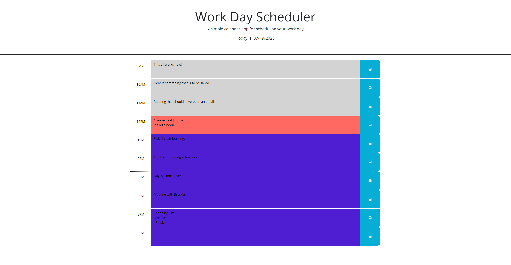

# bootcamp-day-scheduler

Project to dynamically update HTML with CCS powered by jQuery and the Day.js API.

## Sources

- Consulted Nedda on some issues I was having with finding the correct functions to use with jQuery. Wrote some of the homework at work on my laptop, which has Nedda's details saved and I am not sure how to change it.
- https://day.js.org/docs - useful for figuring out what day.js wants and what is returns
- https://www.w3schools.com/jsref/jsref_split.asp - helped with removing the first part of the ID. Feels really messy to make the "hour-" the dividing character
- Phind.com - asked it question on how to slow down how often a loop is called. Gave me code back using the "setTimeout" global function. This seems to cause the webpage to only respond to a single click after the time interval has completed, so I scrapped it.
- https://developer.mozilla.org/en-US/docs/Web/API/setTimeout - used to understand how setTimeout worked. Along with help from the instructor, I was able to get the code working.

### Description

Scheduler that saves notes. It has been tested to work on FireFix and Google Chrome. The webpage checks the hour on first load to change the text boxes to differing colors based on whether the hour was in the past, present, or future. Then, a wait function is called that does a little math to then run the color changing function every hour. There is commented out code that will return a random hour for testing purposes.

## User Story

```md
AS AN employee with a busy schedule
I WANT to add important events to a daily planner
SO THAT I can manage my time effectively
```

## Acceptance Criteria

```md
GIVEN I am using a daily planner to create a schedule
WHEN I open the planner
THEN the current day is displayed at the top of the calendar
WHEN I scroll down
THEN I am presented with timeblocks for standard business hours of 9am&ndash;5pm
WHEN I view the timeblocks for that day
THEN each timeblock is color coded to indicate whether it is in the past, present, or future
WHEN I click into a timeblock
THEN I can enter an event
WHEN I click the save button for that timeblock
THEN the text for that event is saved in local storage
WHEN I refresh the page
THEN the saved events persist
```

### Link to repo

https://github.com/Kylyote/bootcamp-day-scheduler

### Link to deployed page

https://kylyote.github.io/bootcamp-day-scheduler

## What the webpage should look like.


